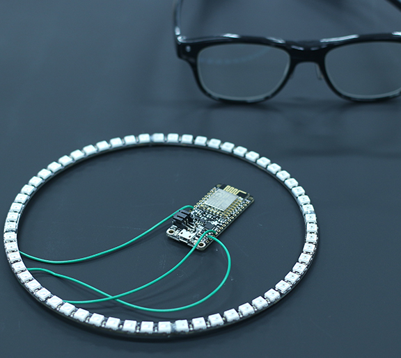
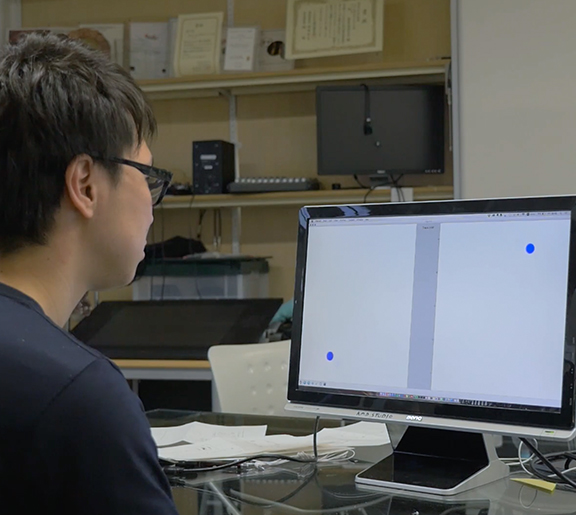
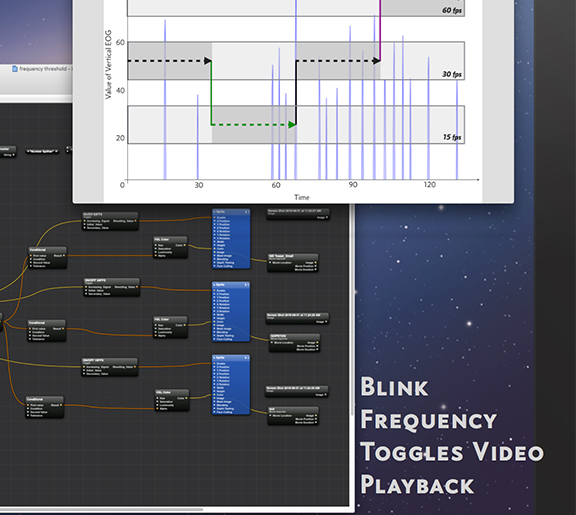
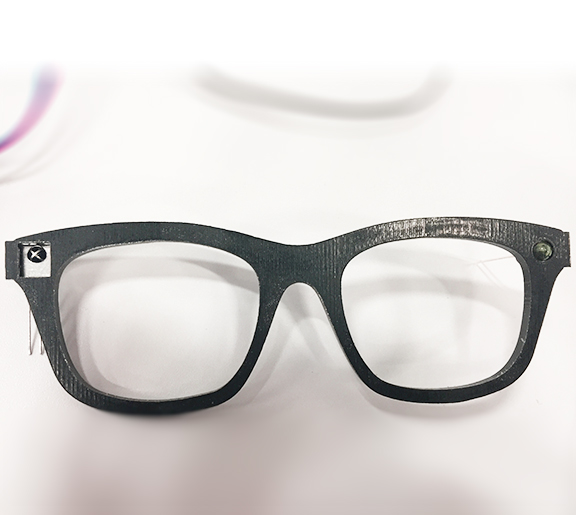

<!-- Main -->

<!-- One -->
<section id="one">
	

		<header class="major">
			<h1>Works</h1>
		</header>

<!-- Content -->
<!-- <h2 id="content">Research Interests </h2> -->

My intersts is mostly related to eyewear computing, especially I'm exploring patterns in human behavior and physiological signals that can reveal information about our mind. one of main goal is to enhance a emotion, memory, focus, problem solving, decision making and comprehension.

	

		

		

		

		<!-- Break -->
		

		

		

		<!-- Break -->
		

		

		

		<!-- Break -->
		

		

		

 
 
<h2 id="content">Other works are comming soon ...</h2>

